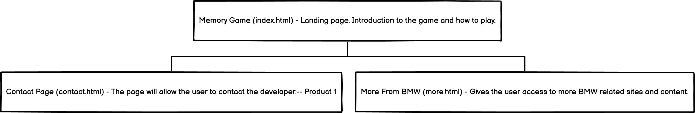
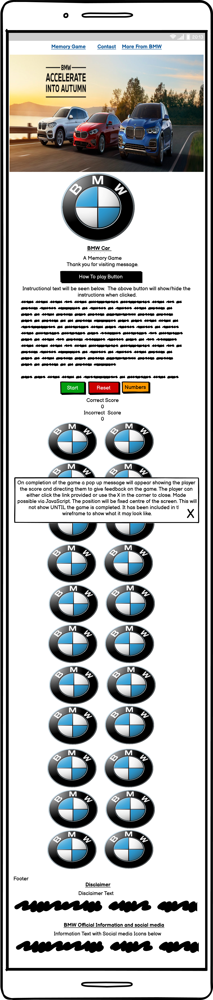
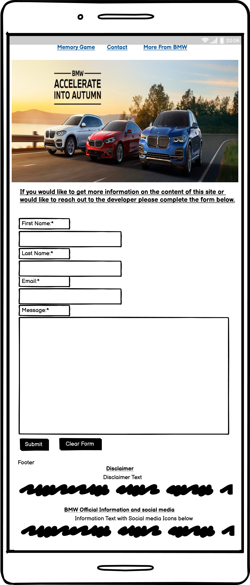
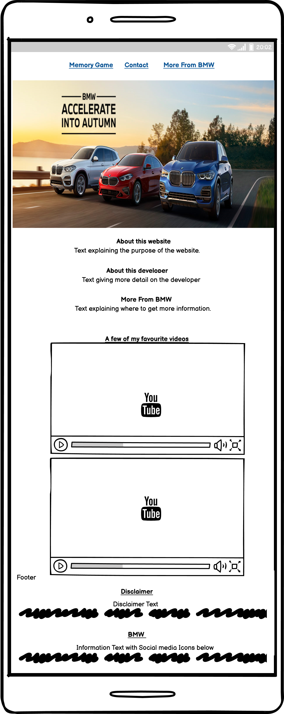
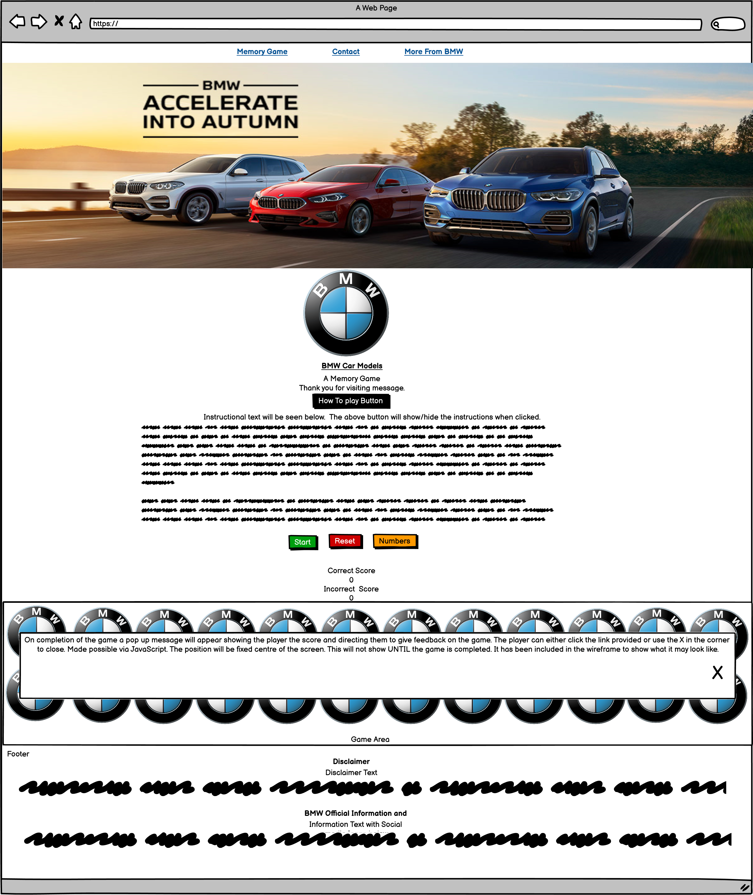
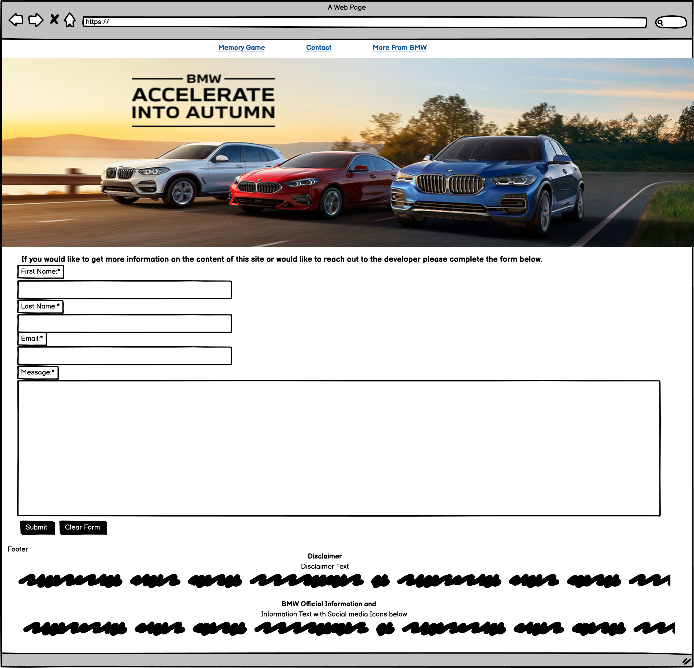
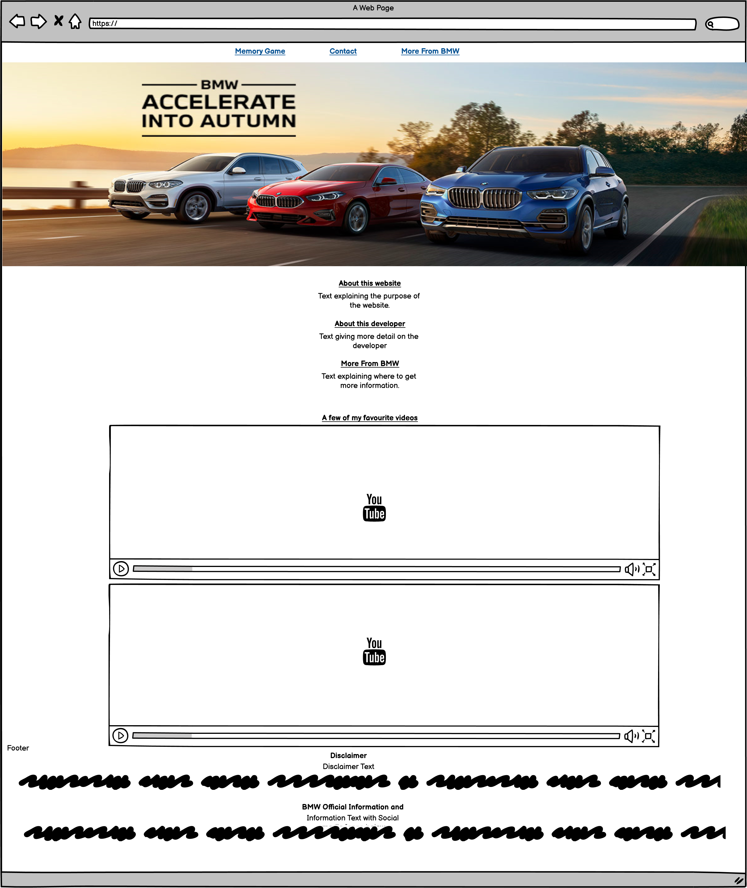
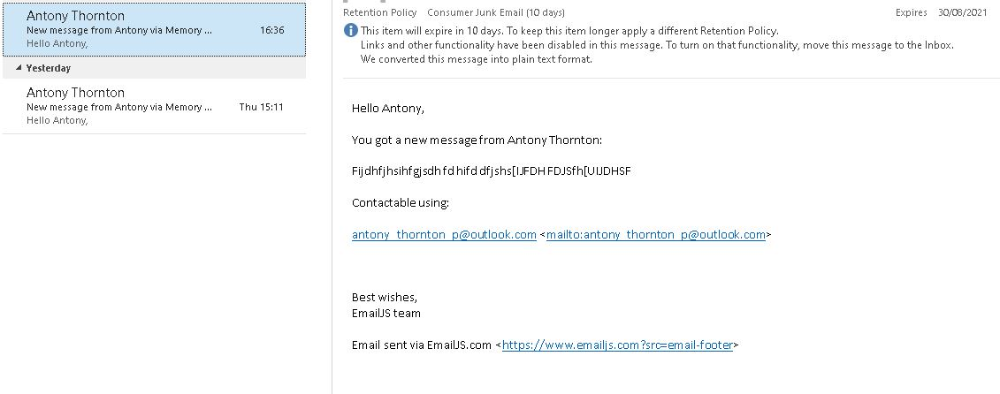

# MS2---Memory-Game

# BMW Memory Game

# Contents

## 1. Project Status
## 2. User Story
* 2.1 The Business Case (Project Goals)
* 2.2 Wireframes
* 2.3 Website Objectives:
* 2.4 Design Inspiration
## 3. Features
* 3.1 Existing Features
* 3.2 Features Left to Implement
* 3.3 Technologies Used
## 4. Testing
* 4.1 Informal
* 4.2 Formal
    - 4.2.1 External Website Testing
     + 4.2.1.1 Testing Results
    - 4.2.2 Functionality Testing
    - 4.2.3 Device Testing
    - 4.2.4 Spelling and Grammar
* 4.3 Build in Progress Bugs
* 4.4 Testing Bugs
## 5. Deployment
* 5.1 Local Deployment
## 6. Credits
* 6.1 Content
* 6.2 Media
* 6.3 Acknowledgements
## 7. Lessons Learnt
* 7.1 Lessons
* 7.2 Future Study Points

# 1. Project Status
Deadline: 22nd August 2021

The project is currently underway. 

The first mentor meeting is booked on the 04/07/2021.

The second mentor meeting is booked on the 12/08/2021.

# 2. User Story
## 2.1 The business case (Project Goals):
A BMW representitive approached me asking for a fun mini game in order to celebrate BMW cars and improve knowledge of the models available.

The overall story would be as follows:
* The user will navigate to the website
* The user will be able to view the instructions and understand how the game works
* The user will be able to play the game
* The user will be able to find out more about BMW, its products, history and offerings
* Most importantly the user should have fun

## 2.2 Wireframes

### Sitemap

### Mobile Wireframes

### Computer Wireframes

## 2.3 Website Objectives:
* The user must have fun
* The BMW brand should be well represented
* The user should learn more about the vehicles available to them
* The website should scroll in a way that allows mobile and computer players to play

## 2.4 Design Inspiration

General

The general color theme of the game tries to mirror the theme in the below links. It uses a mostly white theme with elements of grey.

https://www.bmw.com/en/automotive-life/bmw-logo-meaning-history1.html

https://www.bmw.co.uk/en/index.html

# 3. Features

* The website will have a memory game
* It will have a button that will show and hide game instructions
* It will have a start button to hide content that isnt needed during the game
* It will have a reset game button with the option to remove numbers if they were selected and reset the game tiles
* It will have a numbers button which will replace the BMW Logo with black circles with white numbers. This should make it easier for the user in the mobile version
* The website will have a contact page with a form that will send an email to my account
* The website will have links to official BMW pages and content
* The more page will have embedded videos from BMW YouTube.

## 3.1 Existing Features
n/a

## 3.2 Features Left to Implement
See Testing Bug 3 - Unlikely to be a common issue so will try to fix before project submission.

## 3.3 Technologies Used
HTML 5 - https://html.com/html5/

CSS3 - https://en.wikipedia.org/wiki/CSS

JavaScript - https://www.javascript.com/

Balsamiq Wireframes - https://balsamiq.com/wireframes/

JavaScript code beutifier - https://beautifier.io/ - Corrects javascript code with correct spacing/lines etc.

Am I responsive - http://ami.responsivedesign.is/

# 4. Testing
## 4.1 Informal Development Testing
Informal testing is and was conducted throughout the build. 

My method of testing is based on trial and error, something that I learnt through my time with VBA for MSOffice. I would write a line of code and check the outcome. Mostly working step by step.

The informal process of testing is as follows:
* Before code is written a new preview is opened
* Line/lines of code written
* Preview is opened and refreshed
* Desired outcome is checked
* Outcome is checked in a mobile phone layout using Chrome developer tools.
* If outcome is successful then wider checks on other code are conducted. For example, what impact does it have on other elements.
* If outcome is unsuccessful then the line/lines of code written will be checked and informal testing repeated.

Further testing including sending the website link to my partner who navigated the website on both her phone and tablet.

## 4.2 Formal Deployment Testing
### 4.2.1 External website testing

In order to ensure that my code is correct I used the following website to flag issues with my code.

https://validator.w3.org/ - HTML validator. Looks specifically for errors in my HTML code.

https://jigsaw.w3.org/css-validator/ - CSS validator. Looks specifically for errors in my CSS code.

https://jshint.com/ - Javascript validator. Looks for errors or inconsistencies in the code and suggests solutions.

### 4.2.1.1 Testing Results

### 4.2.2 Functionality Testing

# Home Page

| General Functionality | Expected Result | Result | Potential Fix | Fix Comments
| ------------- |:-------------:| -----:| -----:| -----:
| Memory Game page link | User should see no change in page | Expected result | n/a | n/a
| Contact page link | Link should take user to contact page | Expected result | n/a | n/a
| More from page link | Link should take user to more from BMW page | Expected result | n/a | n/a
| Footer link - Facebook | Link should take user to expected BMW social media page |    Expected result | n/a | n/a
| Footer link - Twitter | Link should take user to expected BMW social media page |    Expected result | n/a | n/a
| Footer link - YouTube | Link should take user to expected BMW social media page 
| Footer link - Official Page | Link should take user to expected BMW social media page |    Expected result | n/a | n/a|    Expected result | n/a | n/a

# Contact Page

| General Functionality | Expected Result | Result | Potential Fix | Fix Comments
| ------------- |:-------------:| -----:| -----:| -----:
| Memory Game page link | Link should take user to BMW memory page | Expected result | n/a | n/a
| Contact page link | User should see no change in page | Expected result | n/a | n/a
| More from page link | Link should take user to more from BMW page | Expected result | n/a | n/a
| Footer link - Facebook | Link should take user to expected BMW social media page |    Expected result | n/a | n/a
| Footer link - Twitter | Link should take user to expected BMW social media page |    Expected result | n/a | n/a
| Footer link - YouTube | Link should take user to expected BMW social media page |    Expected result | n/a | n/a
| Footer link - Official Page | Link should take user to expected BMW social media page |    Expected result | n/a | n/a|    Expected result | n/a | n/a
| Form Functionality | The form should not submit without completed fields | Expected Result | n/a

# More From BMW Page

| General Functionality | Expected Result | Result | Potential Fix | Fix Comments
| ------------- |:-------------:| -----:| -----:| -----:
| Memory Game page link | Link should take user to contact page | Expected result | n/a | n/a
| Contact page link | Link should take user to contact page | Expected result | n/a | n/a
| More from page link | User should see no change in page | Expected result | n/a | n/a
| Footer link - Facebook | Link should take user to expected BMW social media page |    Expected result | n/a | n/a
| Footer link - Twitter | Link should take user to expected BMW social media page |    Expected result | n/a | n/a
| Footer link - YouTube | Link should take user to expected BMW social media page |    Expected result | n/a | n/a
| Footer link - Official Page | Link should take user to expected BMW social media page |    Expected result | n/a | n/a|    Expected result | n/a | n/a
| Links | All links to external sites should direct correctly | Expected result | n/a | n/a
| Videos | Videos should ONLY play when the user clicks play | Expected result | n/a | n/a

# JavaScript Testing

| General Functionality | Expected Result | Result | Potential Fix | Fix Comments
| ------------- |:-------------:| -----:| -----:| -----:
| How to play button | The button should display the instuctions div with associated format | Expected result | n/a | n/a| Expected result | n/a | n/a
| Numbers Button | When clicked the format of the tiles should change to a black circle with white numbered text. Repeated clicks should do nothing | Expected result | n/a | n/a| Expected result | n/a | n/a
| Start Game button | When clicked the hero image should be hidden, close the instructions and the time logged in a variable | Expected result | n/a | n/a| Expected result | n/a | n/a
| Reset Game | The user should be able to reset the game. This will shuffle the id's, ignore message code if numbers not selected, popup message asking the user whether they want the numbers to be reset or not with yes resetting the numbers and no leaving the numbers showing | JS ALWAYS resetting numbers with no popup message | Update the JS function to correctly check for the numbers and if not run the popup function | Testing bugs - Bug 1
| Reset Game | The user should be able to reset the game. This will shuffle the id's, ignore message code if numbers not selected, popup message asking the user whether they want the numbers to be reset or not with yes resetting the numbers and no leaving the numbers showing | JS function was overrulling the user and removing the numbers on reset | Add in additional check to JS function to check if user wants numbers | Testing bugs - Bug 2
| Reset Game | The user should be able to reset the game. This will shuffle the id's, ignore message code if numbers not selected, popup message asking the user whether they want the numbers to be reset or not with yes resetting the numbers and no leaving the numbers showing | If user selects numbers then tries to reset game but times out the next reset will reset the numbers by default | Change JS to accomodate this | Testing bugs - Bug 3
| Reset Game | The user should be able to reset the game. This will shuffle the id's, ignore message code if numbers not selected, popup message asking the user whether they want the numbers to be reset or not with yes resetting the numbers and no leaving the numbers showing | On first click of reset game message to reset numbers would appear | Addd code to check if there are any changes to numbers | Testing bugs - Bug 4
| Reset Game | The user should be able to reset the game. This will shuffle the id's, ignore message code if numbers not selected, popup message asking the user whether they want the numbers to be reset or not with yes resetting the numbers and no leaving the numbers showing | Expected Result - First click bug fixed. Numbers clicked then reset the numbers by selecting yes. Numbers clicked again and no selected from reset game. On additional reset click the numbers remain and a message pops up to ask for reset. | Expected Result | n/a
| Tile click function | The user should be able to click on a tile and flip to show a picture. The user should be able to click a 2nd tile and flip over a 2nd picture | Expected result | n/a
| Tile click function | The function should add 1 to incorrect score and flip tiles back to logo if 2 tiles are incorrectly matched | Expected Result | n/a
| Tile click function | The function should add 1 to correct score and flip tiles back to logo if 2 tiles are correctly matched | Expected Result | n/a
| Tile click function | If the same tile is clicked in succession the function should add 1 to inccorect score and reset the tiles | Tile flips to black instead | Testing Bug 5
| Tile click function | If the same tile is clicked in succession the function should add 1 to inccorect score and reset the tiles | Expected Result | n/a
| Tile click function | When all tiles are matched and score equals 12 a message should popup with score | Expected Result | n/a
| Tile click function | When game complete message pops the link provided should take the user to the contact page | Expected Result | n/a
| Form Javascript | When the user has completed all the fields they should be able to submit the form | Expected Result | N/a
| Form Javascript | The form should send all of the contents/details to my personal email address | Expected Result | n/a
| Form Javascript | If successful the JS will display a success form via HTML | Expected Result | n/a

# HTML Validator Testing

| HTML Validation | Expected Result | Result | Errors | Fix | Fix Comments
| ------------- |:-------------:| -----:| -----:| -----:| -----:|
| Index Page | No Errors | 4 Errors 7 warnings | Duplicate Attribute (center center), No repeat not allowed on image at certain point, same as previous with center, duplicate ID (Number_yes) | Make required changes.
| Index Page | No Errors | 7 warnings | No Errors | n/a
| Contact Page | No Errors | 12 Errors 2 warnings | Duplicate Attribute (center center), No repeat not allowed on image at certain point, same as previous with center, duplicate ID (Number_yes) | Make required changes.
| Contact Page | No Errors | 2 warnings | No Errors | Need to fix name_div Class not applying formats - Bug 6
| More Page | No Errors | 3 Errors 12 warnings | frameborder element is obsolute message | Make required changes.
| Contact Page | No Errors | 3 warnings | No Errors | n/a

# CSS Validator Testing

| CSS Validation | Expected Result | Result | Errors | Fix | Fix Comments
| ------------- |:-------------:| -----:| -----:| -----:| -----:|
| Index Page | No Errors | No Errors found | n/a | n/a | n/a
| Contact Page | No Errors | No Errors found | n/a | n/a | n/a
| More Page | No Errors | No Errors found | n/a | n/a | n/a

# JavaScript Validator Testing

| Javascript Validation | Expected Result | Result | Errors | Fix | Fix Comments
| ------------- |:-------------:| -----:| -----:| -----:| -----:|
| sendEmail.js | No Errors | n/a | One undefined variable 2 emailjs One unused variable 1 sendMail | n/a | n/a
| index.js | No Errors | No Major issues 51 warnings | n/a | n/a | n/a
| unused.js | n/a unused code | n/a| n/a | n/a | n/a

### 4.2.3 Device Testing
tbc

### 4.2.4 Spelling

I have included a specific section for spelling. My dyslexia can make this part particularly troublesome. In order to ensure that my spelling is correct I have taken each page and put it into word to spell check. I then manually correct the page in GitPod.

### 4.2.5 User testing and feedback
tbc

## 4.3 Build in Progress Bugs

* General IF structure issues with JS. To resolve I manually mapped the IF/ELSE statements with comments without coding
* Issue with start and end time. Removed functionality due to issues comparing times of mobile vs desktop completion rates
* When the numbers JS was added a bug when a certain combination of buttons pressed would result in black circles with no numbers
* Issue with emails being sent on contact page being loaded
* Issue with JS script and === or =. Resolved by adding removing = until it worked. See lessons for more information.
* Issue with formatting not applying to "number" JS code changing html classes. Resolved by modifying CSS.
* Issue with my JS code not being able to recognise html elements. Had to add a DIV into the home page and change the innerhtml to true/false when needed.
* Issue with timeout JS code. See JS file for more details and credits for Sean Young's fix.
* Issue with EmailJS sending me blank email templates. I had used "first_name" when I didn't need the ".
* General CSS format issues such as, objects not displaying in line correctly, not being able to overide body format etc.

## 4.4 Testing Bugs
* Bug 1 - Wrote code in the reset game to check if numbers were not selected and if not to skip. It now ALWAYS resets the number and doesnt popup the message.
* Bug 2 - JS function was overrulling the user and removing the numbers on reset
* Bug 3 - If user selects numbers then tries to reset game but times out the next reset will reset the numbers by default
 - Added to features left to implement. Will try to fix before submission
* Bug 4 - On first click of reset game message to reset numbers would appear.  
    - Added number_check variable with If Statement in reset game
* Bug 5 - Tile flips to black instead
* Bug 6 - Changed Name_div from ID to class and formatting fell off even after css changes
    - Bug resolved. Web preview didn’t update straight away.

# 5. Deployment
The website will be deployed using GitHubs built in pages' manager.

Step 1 - Log in to GitHub page

Step 2 - Navigate to project and click settings

Step 3 - In the bar on the left click pages

Step 4 - Under the source dropdown select main and click save

A link should appear above the source dropdown and look something like this

Your site is ready to be published at https://antony-thornton.github.io/MS2---Memory-Game/

## 5.1 Local Deployment

For information on how to clone your files on your desktop. You may need to download GitHub Desktop.
https://docs.github.com/en/github/creating-cloning-and-archiving-repositories/cloning-a-repository-from-github/cloning-a-repository

# 6. Credits
## Content
Where needed source material is referenced below but also in the HTML page itself using comments. I have done it this way so that the referenced material can be easy to find within the code.

## Media
BMW logo - https://external-content.duckduckgo.com/iu/?u=https%3A%2F%2Flogo-logos.com%2Fwp-content%2Fuploads%2F2016%2F10%2FBMW_logo.png&f=1&nofb=1

Hero image link - https://external-content.duckduckgo.com/iu/?u=https%3A%2F%2Fddc1.s3.us-east-1.amazonaws.com%2FNjS7CblGrGnT4miQBA%253D%253D%2FCDy2BvBgoiXPo024%2FVm3qUg%253D%253D%2FBSisF-Rg6GDJp0Sp%2Fheader.jpg&f=1&nofb=1

BMW Stock Images - https://www.pexels.com/

Pexel indivual credits can be seen in the description of the picture itself. i.e. pexels-maria-geller.

For help with the popup message/Modal see credits below.

https://github.com/redouand/Pop-Up-Window-modal-

https://www.youtube.com/watch?v=APG7e7CE5O8

## Acknowledgements
This project was inspired by Code Institute as part of my Second Milestone Project (MS2). 

Thank you to Sean Young from Code institute for helping me with a couple of Javascript queries. See Javascript file for details.

Gradience - https://www.w3schools.com/css/css3_gradients.asp - Helped me learn about css colour gradience.

Hide_unhide elements - https://www.w3schools.com/howto/howto_js_toggle_hide_show.asp - Referenced in code to show/hid objects.

Thank you to:
https://www.gitpod.io/blog/gitpodify/ 
for references to using GitPod. Specifically opening a preview.

Thank you especially to my mentor Marcel for the time and effort provided. Including during his weekend.

Where possible acknowledgements will be noted in the code.

# 7. Lessons learnt
## 7.1 Lessons

Popup window is a very useful tool. It makes the page much more immersive.

How to send emails directly to my personal account. This will be useful for future projects.

I must remember to save the documentation assets in the correct structure i.e. using _ and no spaces.

I learned that you can export PNG files of your balsamiq wireframes. This avoids having to screenshot then snip them together.

## 7.2 Future study points

Learn the difference between ===, == and =. Had an issue where the JS code didnt work as expected due to not having the right amount of =.

Learn to structure Javascript a little better. Code ended up being a bit messy. 

README written by Antony Thornton, 2021

