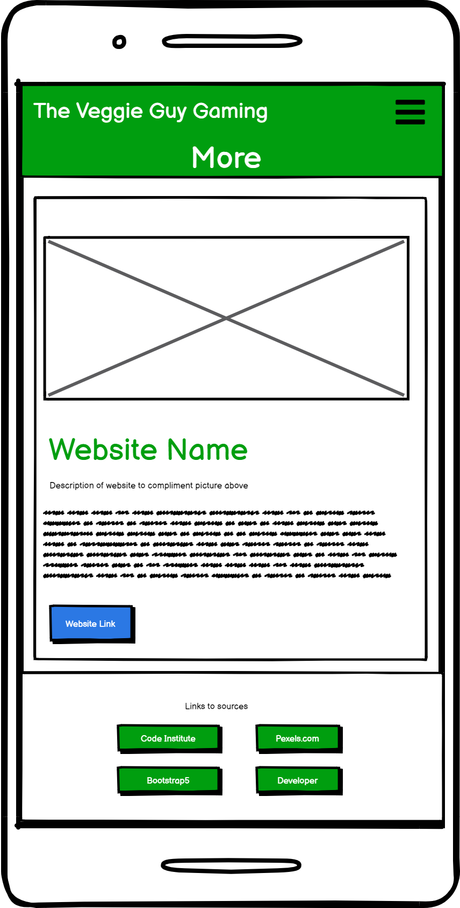

# The Veggie Guy Memory Game
# Introduction
Welcome to my second project. This project is designed to create a fun memory game that compliments "The Veggie Guy" brand. This site will use languages such as HTML, CSS and JavaScript.

A live website can be found <a href="https://antony-thornton.github.io/MS2---Memory-Game/" target="_blank">here</a>.

# Table of Contents

-   [1. UX](#ux)
    -   [1.1. Strategy](#strategy)
        -   [Project Goals](#project-goals)
            -   [User Goals:](#user-goals)
            -   [User Expectations:](#user-expectations)
    -   [1.2. Structure](#structure)
    -   [1.3. Skeleton](#skeleton)
    -   [1.4. Surface](#surface)
-   [2. Features](#features)
-   [3. Technologies Used](#technologies-used)
-   [4. Testing](#testing)
    -   [4.1 Informal Testing](#testing1)
    -   [4.2 Formal Testing](#testing2)
    -   [4.2 Functionality Testing](#testing3)
-   [5. Development Cycle](#development-cycle)
-   [6. Deployment](#deployment)
-   [7. End Product](#end-product)
-   [8. Known Bugs](#known-bugs)
-   [9. Credits](#credits)

# 1.UX
#### [Go To Top](#table-of-contents "Go To Top")

### Introduction
This version of the project is a redesign of the first. The first version of this site was focused mainly on BMW and promoting the brand. As my course has gone on I have decided to align this website with the brand of the later projects. Significant structural and format changes have happened but the driving javascript has been fixed based on feedback. 

The new website should be clearer and more straight forward for the user. It will present more information on "the Veggie Guy" brand, JavaScript and have a fun game for the user to play.

## 1.1 Strategy
#### [Go To Top](#table-of-contents "Go To Top")

## Project Goals
As part of "The Veggie Guy" fitness brand I have been asked to create a fun memory game to compliment the other website offering and reach a wider audience. 

The overall story would be as follows:
* The website should help promote the Veggie guy brand
* The website should direct the user to additional veggie guy websites
* The website should be well structured and easy to navigate
* The new website should be free of previously glagged navigation and UX issues
* The game should be easy to play on all devices including mobile

## User Goals:

### First Time Visitor Goals

The user should:
* Be able to find more information on "the veggie guy" brand
* Have fun playing the mini game

### User Expectations:
The system should have a simple user interface, with the navigation to each section clear and concise.

* Each page is well structured and has a purpose that is clear to the user
* The user interface is easy to navigate
* The website is responsive on all devices

## 1.2 Structure
#### [Go To Top](#table-of-contents "Go To Top")

It is really important to include responsive design in this project as many users are using different devices (mobile, tablet, laptop/PC). This gives the user the best experience on their device.

* Responsive on all device sizes
* Easy navigation through labelled buttons
* All elements will be consistent including font size, font family, colour scheme.

## 1.3 Skeleton
#### [Go To Top](#table-of-contents "Go To Top")

## Sitemap

## Wireframes

## 1.4 Surface
#### [Go To Top](#table-of-contents "Go To Top")

### Font and colours:
The font and colours have been changed in this updated website to reflect "The Veggie Guy" fitness brand. The branding has been created to match the other websites created later in this course to give this page more meaning. 

Fonts used have been pulled through using Bootstrap 5.

A green colour palette has been applied to match the veggie guy theme.

# 2. Features
#### [Go To Top](#table-of-contents "Go To Top")

## Navigation
* The navigation bar has 2 layouts
    * One view for desktop and the other for mobiles/devices with smaller screens
* The desktop view uses a standard bootstrap 5 navigation theme in line with the cookbook project
* The brand logo/image is at the top left with the navigation elements at the top right
* As with the desktop view the mobile uses existing CSS code but compresses the links into a collapsible element at the top right
    * The user should be able to open the element and see all the available links

## Home Page
* The home page is the main landing page for the site
    * When the user visits the page, they should be able to understand what the website is about and what it can offer them
* The page presents information as its primary feature
* It will help direct them to the key pages of the site; memory game, contact and more to compliment the project goals

## Memory Game Page
* This page presents the game itself
* It will have:
    * A series of tiles to turn over
    * How to play instructions
    * A start button
    * A reset button
    * A numbers button - Allows users to replace tile pictures with numbers
    * A score board
    * Time keeping boards
    * A modal to appear when the game is complete

## More Page
* The more page will contain information on the other veggie guy brand websites
* What they are with a brief description of the sites features
* Navigation links to those sites

## JavaScript Page
This page will demo some of the features of JavaScript using event listeners
This page has been included as a way to improve my knowledge on javascript event listeners 

## Features left to implement
* As well as a numbers tab I would like to add a way to turn off the gifs on the memory game
    * Doing this will require updating the javascript to be inclusive but is not critical for submission
* Build this site/game into "the Veggie Guy" fitness site
* Create/design proper wireframe for Javascript page and implement

# 3. Technologies Used
#### [Go To Top](#table-of-contents "Go To Top")

* <a href="https://html.com/html5/" target="_blank">HTML 5</a>  
    * The project uses Hypertext Markup Language
* <a href="https://en.wikipedia.org/wiki/CSS" target="_blank">CSS3</a>
    * The project uses Cascading Style Sheets 
* <a href="https://www.javascript.com/" target="_blank">JavaScript</a>
    * The project uses JavaScript
* <a href="https://getbootstrap.com/" target="_blank">Bootstrap</a>
    * The project uses Bootstrap structuring
* <a href="https://balsamiq.com/wireframes/" target="_blank">Balsamiq Wireframes</a>
    * Balsamiq was used to create the wireframes during the design process
* <a href="https://www.gitpod.io/" target="_blank">Gitpod</a>
    * The project uses Gitpod
* <a href="https://github.com/" target="_blank">GitHub</a>
    * GitHub was used to store the project's code after being pushed from Git
* <a href="https://beautifier.io/" target="_blank">Code beautifier</a>
    * Corrects JavaScript/HTML/CSS code with correct spacing/lines etc.

# 4. Testing
#### [Go To Top](#table-of-contents "Go To Top")

## 4.1 Infomal Testing
Informal testing is and was conducted throughout the build. This does not always include testing 

My method of testing is based on trial and error, something that I learnt through my time with VBA for MSOffice. I would write a line of code and check the outcome. Mostly working step by step.

The informal process of testing is as follows:

* Before code is written a new preview is opened
* Line/lines of code written
* Preview is opened and refreshed
* Desired outcome is checked
* Outcome is checked in a mobile phone layout using Chrome developer tools.
* If outcome is successful then wider checks on other code are conducted. For example, what impact does it have on other elements
* If outcome is unsuccessful then the line/lines of code written will be checked and informal testing repeated

## 4.2 Formal Testing

## Code Validation
 

<a href="https://validator.w3.org/" target="_blank">HTML Validation</a>

Html and css was validated earlier but I made additions so validatied twice. 

| HTML Page | Result | Comments | Retest (if apllicable)|
| ------------- |:-------------:| -----:| -----:|
| Home | Pass| n/a | n/a |
| Memory Game | Pass| n/a | n/a |
| Contact Us | Pass| n/a | n/a |
| Javascript Zone | Pass| n/a | n/a |
| More | Pass| n/a | n/a |

 

<a href="https://jigsaw.w3.org/css-validator/" target="_blank">CSS Validation</a>

 

<a href="https://jshint.com/" target="_blank">JavaScript Validation</a>

## 4.3 Functionality Testing

## Navigation Links

All header and footer links on each page should navigate to the expected page.

| HTML Page | Desktop Result | S9+ Result | iPad result | Comments | Retest (if apllicable)|
| ------------- |:-------------:| -----:| -----:|-----:|-----:|
| Home | 
| Memory Game |
| Contact Us |
| Javascript Zone |
| More | 

 

## Page functionality
## Home Page
| Expected Result | Desktop Result | S9+ Result | iPad result | Comments | Retest (if apllicable)|
|:-------------:| -----:| -----:| -----:|-----:|-----:|

## Memory Game Page
| Expected Result | Desktop Result | S9+ Result | iPad result | Comments | Retest (if apllicable)|
|:-------------:| -----:| -----:| -----:|-----:|-----:|

## Contact Us Page
| Expected Result | Desktop Result | S9+ Result | iPad result | Comments | Retest (if apllicable)|
|:-------------:| -----:| -----:| -----:|-----:|-----:|

## JavaScript Zone Page
| Expected Result | Desktop Result | S9+ Result | iPad result | Comments | Retest (if apllicable)|
|:-------------:| -----:| -----:| -----:|-----:|-----:|

## More Page
| Expected Result | Desktop Result | S9+ Result | iPad result | Comments | Retest (if apllicable)|
|:-------------:| -----:| -----:| -----:|-----:|-----:|

 

# 5. Development Cycle
#### [Go To Top](#table-of-contents "Go To Top")

A Code Insititute template can be found <a href="https://github.com/Code-Institute-Org/gitpod-full-template" target="_blank">here</a>.

### Setting up a new repository. 
1. Go to the link above and click use this template
2. Name it as required and select include all branches
3. Click create new repository
4. Click on the green gitpod button
5. Navigate to <a href="https://gitpod.io/workspaces">gitpod workspaces</a> and pin the workspace
6. Use this link to continue working in that environment

# 6. Deployment
#### [Go To Top](#table-of-contents "Go To Top")

The website will be deployed using GitHubs built in pages' manager.

Step 1 - Log in to GitHub page

Step 2 - Navigate to project and click settings

Step 3 - In the bar on the left click pages

Step 4 - Under the source dropdown select main and click save

A link should appear above the source dropdown and look something like this

Your site is ready to be published at https://antony-thornton.github.io/MS2---Memory-Game/

# 7. End Product
#### [Go To Top](#table-of-contents "Go To Top")

# 8. Known Bugs
#### [Go To Top](#table-of-contents "Go To Top")

Previous website Bugs. Considered still relevant as a lot of the functionality remains unchanged

Round 1 - Pre testing round 1

* General IF structure issues with JS. To resolve I manually mapped the IF/ELSE statements with comments without coding
* Issue with start and end time. Removed functionality due to issues comparing times of mobile vs desktop completion rates
* When the numbers JS was added a bug when a certain combination of buttons pressed would result in black circles with no numbers
* Issue with emails being sent on contact page being loaded
* Issue with JS script and === or =. Resolved by adding removing = until it worked. See lessons for more information.
* Issue with formatting not applying to "number" JS code changing html classes. Resolved by modifying CSS.
* Issue with my JS code not being able to recognise html elements. Had to add a DIV into the home page and change the innerhtml to true/false when needed.
* Issue with timeout JS code. See JS file for more details and credits for Sean Young's fix.
* Issue with EmailJS sending me blank email templates. I had used "first_name" when I didn't need the ".
* General CSS format issues such as, objects not displaying in line correctly, not being able to overide body format etc.

Round 2 - Post testing round 1

* Noticed that if you click on an already "locked" tab the image will turn to black circle. Need to fix
    * } was in the wrong place so added an else to make sure that the JS did nothing.
* Issue with time rounding incorrectly using .fixed(2)
    * Removed the fixed(2)

Round 3 - Pre testing
* Problems with the game controls:
    * The reset button didnt reset everything
    * The tiles could be clicked in quick succession
* CSS styling issues
* Score board styling issue
    * Bug where elements overlapped.
    * Ended up deleting and adding css from <a href="https://stackoverflow.com/questions/5686276/how-to-align-a-div-to-the-top-of-its-parent-but-keeping-its-inline-block-behavio">here</a> and the issue resolved on other devices

    

### Bugs to be fixed
* None at time of writing

# 9. Credits

#### [Go To Top](#table-of-contents "Go To Top")

## Code

* Modals (Popup messages) - <a href="https://github.com/redouand/Pop-Up-Window-modal-">Github here</a> & <a href="https://www.youtube.com/watch?v=APG7e7CE5O8">Youtube here</a>

* <a href="https://github.com/redouand/Pop-Up-Window-modal-">Bootstrap scoring element</a>

* <a href="https://www.w3schools.com/howto/howto_js_toggle_hide_show.asp">Toggle and hide with Javascript</a>

* <a href="https://stackoverflow.com/questions/31106189/create-a-simple-10-second-countdown#31106229">10 Second Countdowns</a>

* <a href="https://www.geeksforgeeks.org/how-to-select-a-random-element-from-array-in-javascript/">Selecting a random element from an array</a>

* <a href="https://www.geeksforgeeks.org/create-countdown-timer-using-javascript/">Clock JavaScript</a>

* <a href="https://www.w3schools.com/w3css/tryit.asp?filename=tryw3css_slideshow_rr">Slide Show JavaScript</a>

* <a href="https://stackoverflow.com/questions/16270761/how-to-insert-a-large-block-of-html-in-javascript">Inserting HTML elements with JavaScript</a>

* <a href="https://www.delftstack.com/howto/javascript/javascript-set-session-variable/">Session variables</a>

## Content

* <a href="https://gitpod.io/workspaces">Pexels</a> - The pictures featured were taken from pexels.com. Individual credits can be found in the assets of this repository

## Project Acknowledgements

* Thank you to Sean Young from Code institute for helping me with a couple of Javascript queries. See Javascript file for details.

* Code Institute - For all course material and on going support

* Code Institute Tutor Support - For directing me to the correct solutions for any bugs and problems with my project.

* My Mentor Marcel - For his constructive criticism and always pushing me to go further to develop my skills.